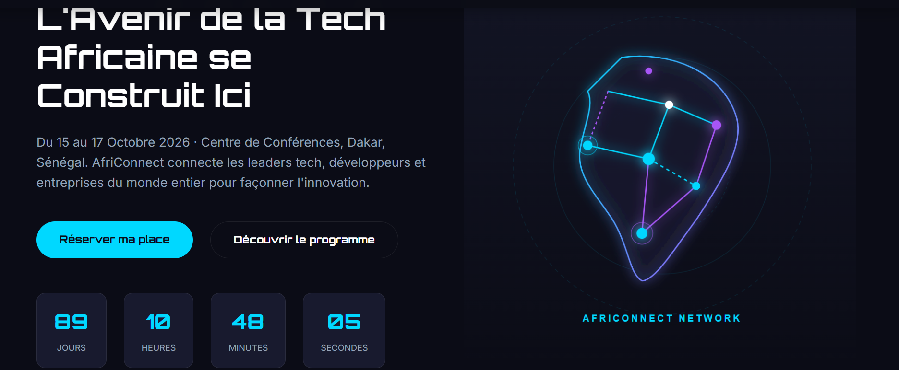
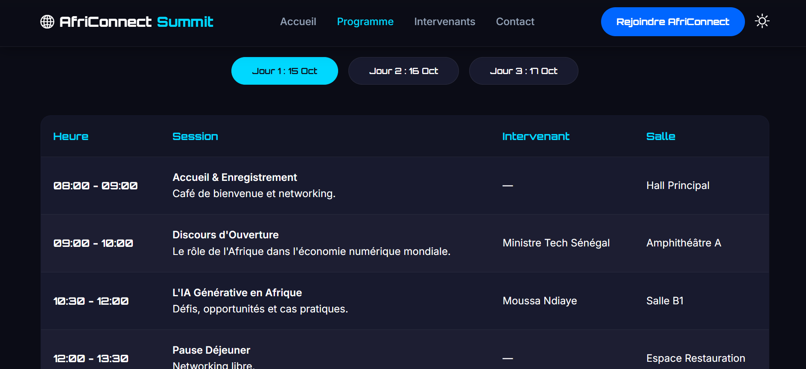
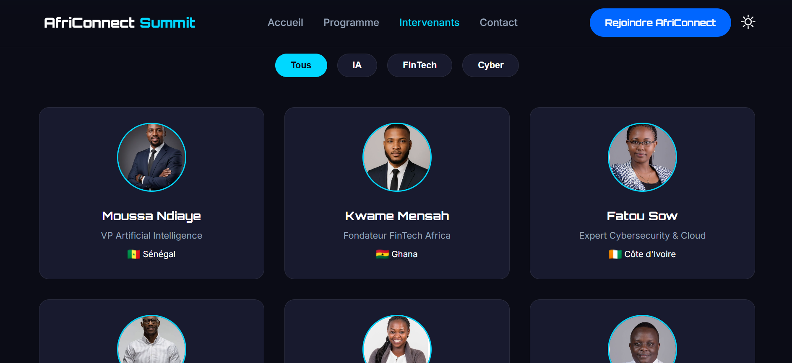
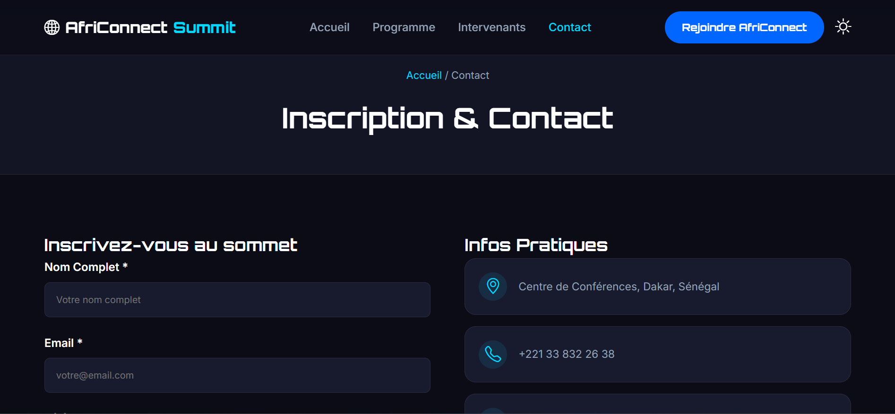

# 🌍 AfriConnect Summit 2026

Mouhamadou Moustapha Cissokho L1CS ---ISI

> **AfriConnect Summit 2026** est une plateforme web moderne et dynamique dédiée à l'événement tech majeur du continent africain. Le site met en avant les leaders de l'industrie, le programme des conférences, les inscriptions et offre une expérience utilisateur fluide avec une esthétique **Dark Tech Futuriste**.

---

## 📸 Aperçu du Projet

- **Thème principal :** Dark Tech (Inspiré par le design système AfriTalent)
- **Palette de couleurs :** Cyan Néon (`#00d8ff`), Violet (`#a855f7`), Bleu Électrique (`#0066ff`), Fond Sombre (`#0b0c16`)
- **Typographies :** `Orbitron` (Titres / Tech) & `Inter` (Corps de texte)
- **Design System :** 100% Responsive & Adaptatif (Light / Dark Mode)

---

## 🚀 Fonctionnalités Principales

### 📱 Front-End & Expérience Utilisateur
* **Animation d'Entrée (Fade-In) :** Transition fluide lors de la navigation entre les différentes pages.
* **Theme Switcher (Mode Sombre / Mode Clair) :** Bascule dynamique sauvegardée automatiquement dans le `localStorage`.
* **Compte à Rebours (Countdown) :** Temps restant mis à jour en temps réel jusqu'à la date de l'événement (15 Octobre 2026).
* **Menu Mobile Responsive :** Menu hamburger interactif pour un confort de lecture optimal sur smartphone et tablette.
* **Bouton Retour en Haut (Back to Top) :** Navigation rapide vers le haut de page avec défilement fluide (`smooth scroll`).

### 📄 Pages & Modules
1. **`index.html` (Accueil) :**
   - Section Hero impactante avec illustration SVG vectorielle ("Répartition Tech Afrique").
   - Compte à rebours temps réel.
   - Statistiques clés et aperçu des intervenants vedettes.
   
2. **`programme.html` (Planning) :**
   - Système d'onglets (`Tabs`) interactifs par jour (Jour 1, Jour 2, Jour 3).
   - Planning détaillé des conférences et ateliers.
   
3. **`intervenants.html` (Speakers) :**
   - Grille de cartes de présentation des experts tech.
   - Système de filtrage dynamique par domaine (*IA, FinTech, Cybersécurité, Cloud*).
   
4. **`contact.html` (Accès & Inscription) :**
   - Formulaire de contact/réservation avec validation JavaScript et message de confirmation.
   - Informations pratiques d'accès à l'événement.
   

---

## 🛠️ Technologies Utilisées

* **HTML5 Sémantique :** Structuration propre et optimale pour l'accessibilité et le SEO.
* **CSS3 Moderne :**
  * Variables CSS (`:root`) pour la gestion des thèmes.
  * Flexbox & CSS Grid pour des layouts complexes et réactifs.
  * Animations et transitions fluides (`keyframes`, `backdrop-filter`).
* **JavaScript (Vanilla JS ES6+) :**
  * Manipulation du DOM sans dépendances externes.
  * `localStorage` pour la persistance du thème choisi par l'utilisateur.
  * Événements asynchrones (`setInterval` pour le countdown).
* **Assets & Bibliothèques Visuelles :**
  * [Remixicon](https://remixicon.com/) pour les icônes vectorielles.
  * [Google Fonts](https://fonts.google.com/) (`Orbitron` & `Inter`).
  * Illustrations au format SVG natif.

---

## 📂 Structure du Projet

```text
africonnect-summit/
│
├── index.html              # Page d'accueil principale
├── programme.html          # Planning de l'événement (avec onglets JS)
├── intervenants.html       # Liste et filtres des speakers
├── contact.html            # Formulaire de contact et réservations
│
├── css/
│   └── style.css           # Feuille de style unique et design system
│
├── js/
│   └── main.js             # Logique JavaScript (Thème, Countdown, Filtres, Animations)
│
├── Images/
│   ├── afrique-tech.svg    # Illustration vectorielle de l'accueil
│   ├── speaker1.jpg        # Photos des intervenants
│   ├── speaker2.jpg
│   └── speaker3.jpg
│
└── README.md               # Documentation du projet